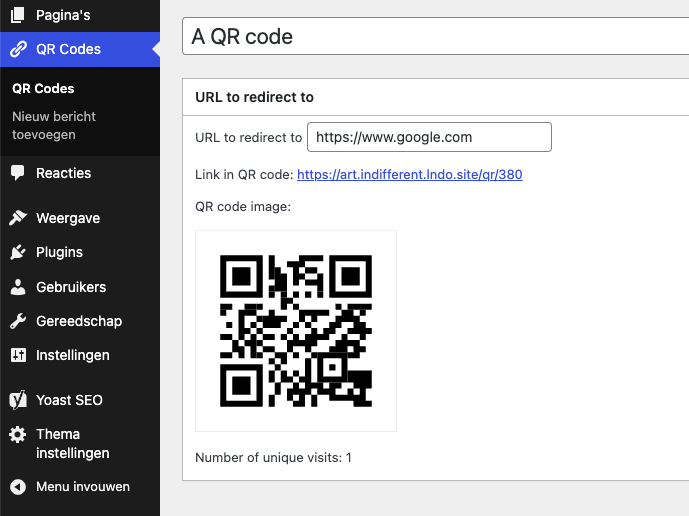

<p align="center"><picture>
  <source media="(prefers-color-scheme: dark)" srcset="https://fabrikage.nl/assets/img/logo-alt.svg">
  
</picture></p>

# <p align="center">fabrikage/qr-codes</p>

<p align="center">A WordPress plugin to generate QR codes</p>

\
&nbsp;

## Requirements

- PHP 8.1 or higher
- [ext-mbstring](https://www.php.net/manual/book.mbstring.php)

## Installation with Composer

```bash
composer require fabrikage/qr-codes
```

## Screenshot


